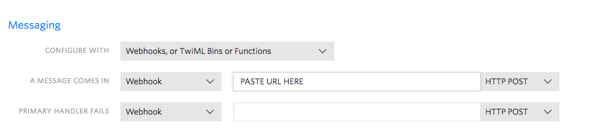

# repLookup

A SMS based application to get your state and national reps' contact information on your phone 🇺🇸 ☎️ 


This application uses the [Google Civic Information API](https://developers.google.com/civic-information/), [Twilio](https://www.twilio.com), and [Heroku](https://www.heroku.com/) for deployment.

### Setup:

## Google Maps Geocoding API

You will need to get a [Google Civic Information API Key](https://developers.google.com/civic-information/docs/using_api) to use this application. After you have gotten a key, store it as an environment variable. To run it locally, you can store it like this:

```
export GOOGLE_KEY=XXXXXXXXXXXXXXXXXXXXXXXXXXXXXXXXXXXXXXX
```

## Twilio API

You will also need a Twilio account and phone number. Since this takes advantage of webhooks/TwiML, you don't need to store any Twilio credentials, but you do need to have a public facing server. Locally, you can create this with [ngrok](https://ngrok.com). If you deploy the application to Heroku or other hosting options, you can use the address for the application as part of your setup. 

Once you have purchased a Twilio phone number and are logged into your account: 

1. Go to the "Phone Numbers" section (also shown as "#") and make sure you are in the "Manage Numbers" section
2. In the "Active Numbers" section, select the phone number you want to use
3. In the "Configure" section for that number, locate the "Messaging" section at the bottom
4. In the text box next to "A Message Comes In" make sure that "Webhook" is selected
5. Paste the URL of your application in the text box next to this section as seen in the picture below:



(TODO: Add pictures of Twilio settings and more details)

### FAQs:

**Is it sketchy to give a random number your address?**
Kinda. I wouldn't personally give a stranger my address. A few things to know: The addresses and phone numbers are not being used for anything other than lookup. Be aware: Twilio will have a record of it in their logs though. 

**Why do I need to give an exact address and not just a zip code?**
Sometimes a single zip code can be part of multiple districts. For the most accurate results, latitude and longitude of addresses is being used for lookup. Future versions will be smarter about this.
