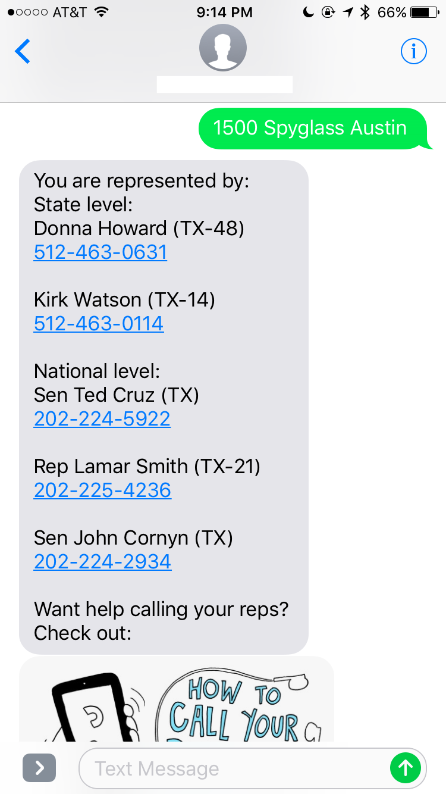

# repLookup

A SMS based application to get your state and national reps' contact information on your phone 🇺🇸 ☎️ 



This application uses the [Google Maps Geocoding API](https://developers.google.com/maps/documentation/geocoding/intro), [Open States API](http://docs.openstates.org/api/index.html), [Sunlight Foundation Congress API](https://sunlightlabs.github.io/congress/) (soon to be merged with ProPublica Congress API), [Twilio](https://www.twilio.com), and [Heroku](https://www.heroku.com/) for deployment.

### Setup:

You will need to get a [Google Maps API Key](https://developers.google.com/maps/documentation/geocoding/get-api-key) to use this application. After you have gotten a key, store it as an environment varible. To run it locally, you can store it like this:

```
export GOOGLEMAPSKEY=XXXXXXXXXXXXXXXXXXXXXXXXXXXXXXXXXXXXXXX
```

You will also need a Twilio account and phone number. Since this takes advantage of webhooks/TwiML, you don't need to store any Twilio credentials, but you do need to have a public facing server. Locally, you can create this with [ngrok](https://ngrok.com). If you deploy the application to Heroku or other hosting options, you can use the address for the application as part of your setup. (TODO: Add pictures of Twilio settings and more details)

### FAQs:

**Is it sketchy to give a random number your address?**
Kinda. I wouldn't personally give a stranger my address. A few things to know: The addresses and phone numbers are not being used for anything other than lookup. Be aware: Twilio will have a record of it in their logs though. 

**Why do I need to give an exact address and not just a zip code?**
Sometimes a single zip code can be part of mutliple districts. For the most accurate results, latitude and longitude of addresses is being used for lookup. 
